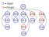

Corbin Mayes										1/10/2019

#Cannibals and Missionaries Assignment

##Introduction

For the upperbound on the number of nodes in the graph, legal or not, was 30. I was able to get this by using the code I wrote and just removing the rules that say missionaries have to be greater than the cannibals then print out the length of the visited list.

####Drawing

##Building the Model

This section was just building the graph and having the rules layed out so that illegal states would be removed from the list. I started off by having two lists to keep track of which states need to be visited and have already visited and also two hashmaps that keep track of the parent and children relationships of nodes. From there I built the get_successors to get all the possible states from the current one and then have them be tested in a helper that makes sure they follow the rules. Finally I added the test_goal_state method to see if a state is the end goal of the problem.

##Breadth First Search

For Breadth First Search, I split it into two methods: the main bfs search method that conducts the search and a backchaining helper method that takes the goal state and returns the path back to the start of the graph. After generating the graph of the problem, the bfs method uses a set and a queue to contain all the information. The set contains all the visited spaces which makes more sense than a list because the information being stored does not need to be in any order. A list would just take more time. The Queue contains the various states need to be explored. The actual search function then tests the state to see if it is the goal and then adds its children to the queue.

##Memoizing Depth First Search

This search method would not save any memory over breadth first search because both store the entire visited path so that a node is not searched more than once.

##Path-checking Depth First Search

For the Path-checking depth first search I had a function that I called that calls the recursive helper method. The recursive helper method starts with the start_state and then tests to see if the current state is the goal and then tests if the depth is not past the limit. If the depth is past the limit it returns cutoff and ends the method. But if the goal state is found then the recursion will back track and return the path to the goal state.
Path-checking dfs should save significant memory compared to bfs due to the fact it is only keeping track of the current path and not the entire visited list of states and if the graph is very large, this will save a lot of memory.
Below is a graph where the run time for path-checking dfs is significantly larger than bfs. This is just due to the nature of the searches because the dfs will go as deep on the left side before checking the right but bfs will sweep level by level checking both sides evenly.

####Drawing

##Iterative Deepening Search

The IDS simply calls the DFS each time increasing the limit by one until it reaches the given limit or until it finds the goal. On a graph for IDS it would make more sense to use path-checking DFS because it saves memory which is the only benefit of a dfs over a bfs so memoizing dfs makes sense since it requires the same level of memory use as a bfs.

##Discussion question: Lossy Missionaries and Cannibals

The state of this problem would be the number of missionaries and cannibals on the left side of the river and the number of missionaries on the right side of the river. This is because we need to know where all the missionaries are at all time because now that some can get eaten we can't just assume the rest are on the other side of the river if we have the number of one side of the river. To implement this it would just take a little bit of alteration to the rules so that it is acceptable to have only so many missionaries remaining. The upper bound should still remain 30 because its not like there are new possibilities of mixing and matching the missionaries and cannibals, just some states are now legal that would've been illegal prior to this change.

